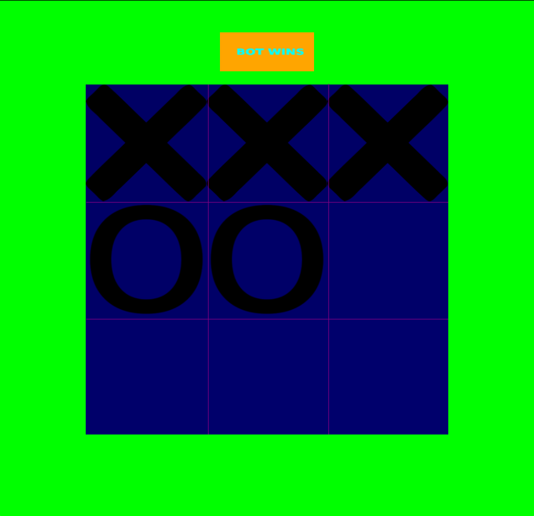
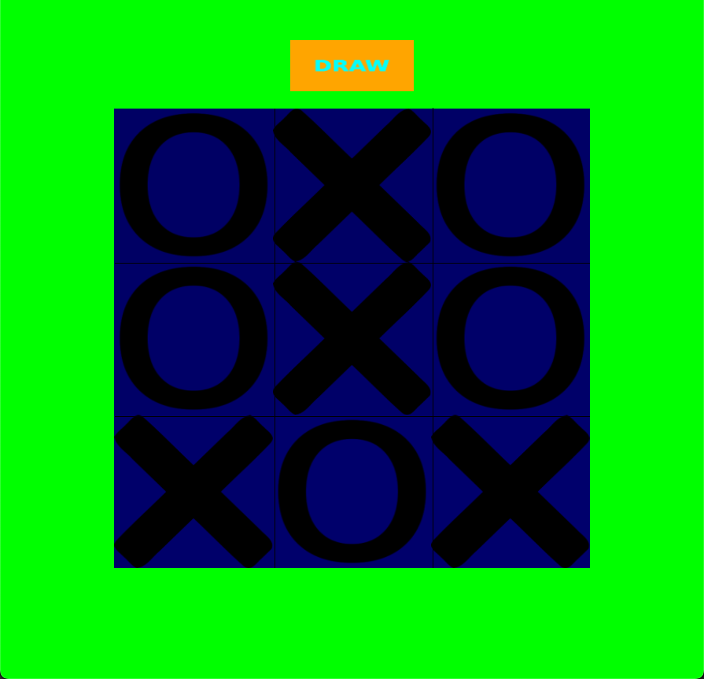

# Tic Tac Toe 

This is a simple Tic Tac Toe game that I created with just Opengl and glfw.
The bot you play against is implemented with the Mini Max Algorithmn, meaning you will never win. 
The Mini Max algorithm ensures that at best you will only tie the game. 



  


## Getting started
Start by cloning the repo  
  ```bash
  git clone github.com/Brady-Brandt/TicTacToe
```
Install the dependencies
### Macos
```zsh
brew install glfw
cd TicTacToe
make -B MACOS
```

### Arch Linux 
```bash
sudo pacman -S glfw
cd TicTacToe
make -B
```
*Note you may need to install the necessary opengl drivers  


## How to play 
  1. Start the progam. A game will instantly start upon execution.
  2. The bot moves almost instantly, so it should be your turn right away. Click any open square where you want to move.
  3. The bot will play its move very quickly and it will be your turn again.
  4. Continue until you lose or it ends in a draw.
  5. Press the space bar to play again or escape to exit


